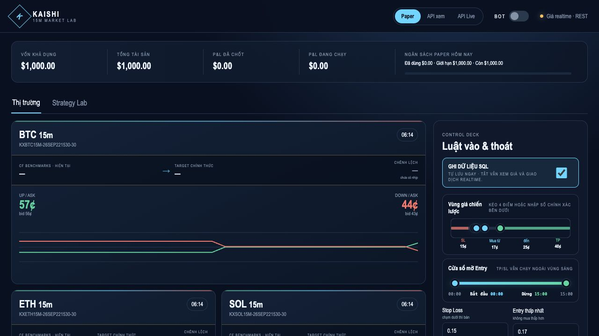
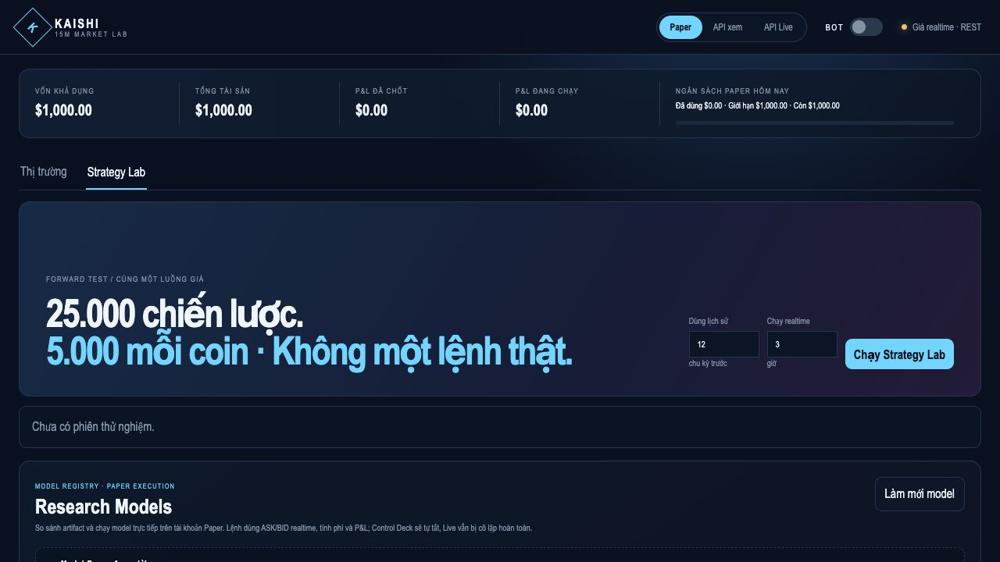

# Kaishi — 15-Minute Market Lab

Kaishi is a local-first Python dashboard for exploring Kalshi's 15-minute crypto markets. It brings market quotes, paper trading, strategy experiments, and ML research tools into one interface. The project tracks BTC, ETH, SOL, XRP, and DOGE and keeps a clear boundary between simulated activity and optional real-account access.

> This is a research and software-engineering project, not a claim of profitable trading or financial advice. The screenshots below show Paper mode; no real orders were placed for them.

## Interface

**Market dashboard.** Live public quotes, a simulated account, asset cards, and an entry/exit control deck.



**Strategy Lab.** A separate workspace for screening strategy candidates and inspecting research models. The screenshot shows the initial state, before any experiment has been run.



## What it does

- **Market monitor:** discovers active 15-minute markets and displays executable UP/DOWN quotes, timers, and recent price traces for five assets.
- **Paper trading:** maintains a local simulated account, positions, P&L, per-order limits, daily budget, and configurable entry/TP/SL rules.
- **Strategy Lab:** generates candidate strategies, evaluates them against shared market data, and reports metrics such as net return, drawdown, trade count, and insufficient-sample warnings. Rankings are exploratory, not evidence of future performance.
- **Research pipeline:** optional event capture and point-in-time feature construction for chronological experiments; includes XGBoost probability modeling and Monte Carlo risk-guard components. Model artifacts and collected data remain local.
- **Guarded account modes:** Paper is the default for a fresh local database. Read-only API and Live modes are separate; Live order entry requires credentials and an explicit arming challenge.

## Example applications

1. **Explore short-horizon market behavior:** compare quotes, spreads, and price movement across 15-minute crypto contracts.
2. **Prototype risk controls without real orders:** test entry bands, take-profit/stop-loss thresholds, position sizing, and daily limits using Paper mode.
3. **Compare strategy candidates:** use Strategy Lab to identify which ideas merit deeper evaluation, while accounting for fees, drawdown, and sample size.
4. **Build an ML research dataset:** capture market events, construct point-in-time features, and evaluate probability models with chronological splits before considering any deployment.

## Architecture

```text
Kalshi public market data ──> market discovery / quote stream ──> local dashboard
                                      │                         ├─ Paper broker
                                      │                         └─ Strategy Lab
                                      └─ optional research capture ──> features / models

Optional account credentials ──> read-only or guarded Live gateway
```

The backend uses Python, FastAPI, SQLite, and NumPy. The dashboard is served from the same local app with HTML, CSS, and JavaScript. Research dependencies such as PyArrow and XGBoost are optional.

## Run locally

Requires Python 3.12 or newer. No API key is needed to view public market data or start with a fresh Paper account.

```bash
python3.12 -m venv .venv
source .venv/bin/activate
python -m pip install -e ".[dev]"
bot dashboard
```

Open `http://127.0.0.1:5714`. The dashboard binds to localhost only. Its local SQLite state is created on first run and excluded from Git.

For optional research tooling, install `.[research,ml]`. Copy `research_capture.example.yaml` to `research_capture.yaml` before enabling capture; the example is disabled by default. See the code and configuration example for details.

## Safety and limitations

- **Live mode can place real orders.** Review the code, exchange rules, and your own risk controls before supplying credentials or arming it. Never commit private keys, `.env` files, databases, logs, or research artifacts.
- A strategy ranking from a short period can be noisy or overfit. The project does not provide a validated profitability result.
- Market availability and prices change over time. The UI screenshots are point-in-time examples from a credential-free Paper session.

## Tests

```bash
python -m pytest -q
```

The curated public snapshot passed **297 tests** at publication time.
